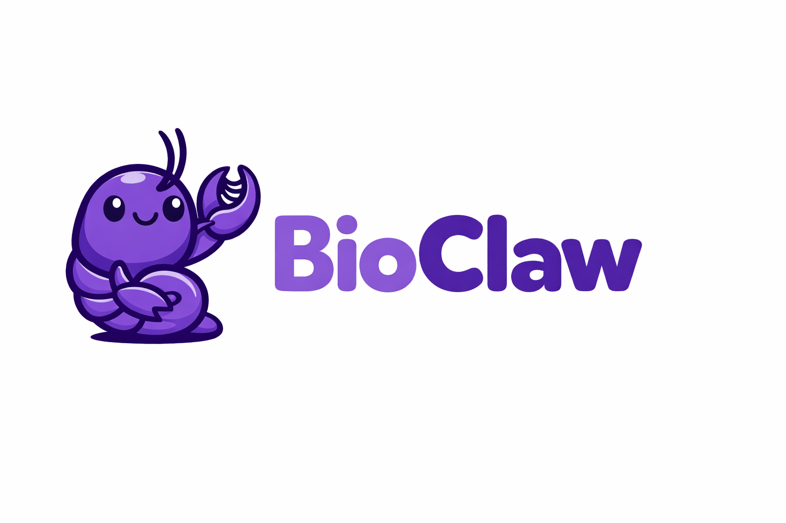

<p align="center">
  
</p>

<p align="center">
  A biomedical AI assistant with 37 MCP-powered research tools and 173 specialized domain skills running securely in containers. Built on <a href="https://github.com/qwibitai/nanoclaw">NanoClaw</a>.
</p>

BioClaw bundles 37 [OpenPharma](https://github.com/openpharma-org) MCP servers directly into the container image — no cloning repos, no configuring paths. One image, zero setup.

## What's Included

**37 MCP servers** from [OpenPharma](https://github.com/openpharma-org):

| Category | Servers |
|----------|---------|
| **Drug & Regulatory** | [FDA](https://github.com/openpharma-org/fda-mcp), [EMA](https://github.com/openpharma-org/ema-mcp), [DrugBank](https://github.com/openpharma-org/drugbank-mcp-server), [ChEMBL](https://github.com/openpharma-org/chembl-mcp), [PubChem](https://github.com/openpharma-org/pubchem-mcp), [OpenTargets](https://github.com/openpharma-org/opentargets-mcp), [ClinicalTrials.gov](https://github.com/openpharma-org/ct-gov-mcp) |
| **Literature** | [PubMed](https://github.com/openpharma-org/pubmed-mcp), [bioRxiv](https://github.com/openpharma-org/biorxiv-mcp), [OpenAlex](https://github.com/openpharma-org/openalex-mcp-server), [NLM](https://github.com/openpharma-org/nlm-codes-mcp) |
| **Genomics & Variants** | [ClinVar](https://github.com/openpharma-org/clinvar-mcp-server), [COSMIC](https://github.com/openpharma-org/cosmic-mcp-server), [GWAS Catalog](https://github.com/openpharma-org/gwas-mcp-server), [gnomAD](https://github.com/openpharma-org/gnomad-mcp-server), [Ensembl](https://github.com/openpharma-org/ensembl-mcp-server), [GTEx](https://github.com/openpharma-org/gtex-mcp-server), [GEO](https://github.com/openpharma-org/geo-mcp-server), [JASPAR](https://github.com/openpharma-org/jaspar-mcp-server) |
| **Proteomics & Structure** | [UniProt](https://github.com/openpharma-org/uniprot-mcp-server), [AlphaFold](https://github.com/openpharma-org/alphafold-mcp-server), [PDB](https://github.com/openpharma-org/pdb-mcp-server), [STRING-db](https://github.com/openpharma-org/stringdb-mcp-server), [BindingDB](https://github.com/openpharma-org/bindingdb-mcp-server) |
| **Pathways & Ontology** | [Reactome](https://github.com/openpharma-org/reactome-mcp-server), [KEGG](https://github.com/openpharma-org/kegg-mcp-server), [Gene Ontology](https://github.com/openpharma-org/geneontology-mcp-server), [HPO](https://github.com/openpharma-org/hpo-mcp-server), [Monarch](https://github.com/openpharma-org/monarch-mcp-server) |
| **Cancer & Dependencies** | [DepMap](https://github.com/openpharma-org/depmap-mcp-server), [cBioPortal](https://github.com/openpharma-org/cbioportal-mcp-server) |
| **Metabolomics** | [HMDB](https://github.com/openpharma-org/hmdb-mcp-server) |
| **Pharmacogenomics** | [ClinPGx](https://github.com/openpharma-org/clinpgx-mcp-server) |
| **Healthcare** | [Medicare](https://github.com/openpharma-org/medicare-mcp), [Medicaid](https://github.com/openpharma-org/medicaid-mcp-server), [CDC](https://github.com/openpharma-org/cdc-mcp), [EU Filings](https://github.com/openpharma-org/eu-filings-mcp-server) |

## Agent Skills (141 domain + 32 tooling) + Recipes (110)

The container agent has access to 141 specialized domain skills, 14 superpowers workflow skills, 12 Apify scraping skills, 4 tool skills, 2 design pipeline skills, and 110 recipe/reference files that guide its reasoning and workflows:

| Domain | Skills |
|--------|--------|
| **Genomics & Variants** | variant-interpretation, variant-analysis, cancer-variant-interpreter, GWAS (SNP interpretation, fine-mapping, trait-to-gene, study explorer, drug discoverer), structural-variant-analysis, copy-number-analysis, rare-disease-diagnosis, comparative-genomics, regulatory-genomics, sequence-retrieval |
| **Transcriptomics** | rnaseq-deseq2, single-cell-analysis, spatial-transcriptomics, spatial-omics-analysis, ribo-seq-analysis, alternative-splicing, temporal-genomics, gene-enrichment |
| **Epigenomics** | atac-seq-analysis, chip-seq-analysis, chromatin-conformation, methylation-analysis, rna-modification-analysis, epigenomics |
| **Proteomics & Structure** | alphafold-structures, pdb-structures, protein-interactions, protein-structure-retrieval, stringdb-interactions, proteomics-analysis, antibody-engineering, protein-therapeutic-design, enzyme-engineering, biologic-quality |
| **Structure Prediction** | colabfold-predict, boltz-predict, chai-predict, protenix-predict, highfold-cyclic |
| **Protein Design** | rfdiffusion-design, rfdiffusion3-design, proteinmpnn-design, caliby-design, bindcraft-design, boltzgen-design, proteina-complexa-design, mosaic-hallucination, pepmlm-design |
| **Simulation & Dynamics** | molecular-dynamics, bioemu-ensemble |
| **Pathways & Annotation** | reactome-pathways, kegg-database, geneontology, hpo-phenotypes, uniprot-protein-data, ensembl-genomics, gtex-expression, gene-regulatory-networks |
| **Multi-Omics** | multi-omics-integration, multiomic-disease-characterization, metabolomics-analysis, toxicogenomics, systems-biology |
| **Drug Discovery** | drug-target-analyst, drug-target-validator, drug-repurposing-analyst, target-research, binder-discovery-specialist, medicinal-chemistry, formulation-science, network-pharmacologist, molecular-glue-discovery, neuroscience-drug-discovery, drug-research |
| **Pharmacology** | pharmacogenomics-specialist, clinical-pharmacology, drug-interaction-analyst, chemical-safety-toxicology, pharmacovigilance-specialist |
| **Precision Medicine** | biomarker-discovery, precision-medicine-stratifier, precision-oncology-advisor, immunotherapy-response-predictor, polygenic-risk-score |
| **Clinical** | clinical-trial-protocol-designer, clinical-trial-analyst, clinical-report-writer, clinical-decision-support, clinical-guidelines, prior-auth-reviewer |
| **Regulatory & Safety** | fda-consultant, iso-13485-consultant, mdr-745-consultant, capa-officer, qms-audit-expert, adverse-event-detection, gdpr-privacy-expert, risk-management-specialist, biologic-quality |
| **Population & Metagenomics** | phylogenetics, metagenomics-analyst, microbiome-analyst, genome-assembly, long-read-sequencing, immune-repertoire-analysis, flow-cytometry |
| **Immunology & Oncology** | immunology-analyst, infectious-disease-analyst, crispr-screen-analysis |
| **Healthcare IT** | fhir-developer, lab-data-standardization |
| **Research & Reasoning** | deep-research, literature-deep-research, systematic-literature-reviewer, hypothesis-generation, experimental-design, research-problem-selection, research-synthesis, research-grants, competitive-intelligence, statistical-modeling, scientific-writing, scientific-critical-thinking, scientific-visualization, peer-review, reproducibility-audit, exploratory-data-analysis, disease-research |
| **Thinking Frameworks** | first-principles, abductive-reasoning, adversarial-collaboration, socratic-inquiry, delphi-method, what-if-oracle, meta-cognition, red-team-science, systems-thinking |
| **Apify Scraping** | apify-ultimate-scraper, apify-actor-development, apify-actorization, apify-audience-analysis, apify-brand-reputation-monitoring, apify-competitor-intelligence, apify-content-analytics, apify-ecommerce, apify-influencer-discovery, apify-lead-generation, apify-market-research, apify-trend-analysis |
| **Superpowers (Dev Workflow)** | brainstorming, writing-plans, executing-plans, subagent-driven-development, dispatching-parallel-agents, test-driven-development, systematic-debugging, requesting-code-review, receiving-code-review, finishing-a-development-branch, using-git-worktrees, using-superpowers, verification-before-completion, writing-skills |
| **Tools** | agent-browser, pdf-reader, image-analysis, pipeline-engineering |

## Quick Start

```bash
git clone https://github.com/uh-joan/bioclaw.git
cd bioclaw
claude
```

Then run `/setup`. Claude Code handles dependencies, authentication, container setup and service configuration.

## Building the Container

```bash
# Build the MCP-bundled image (stages all 37 servers, then builds)
./container/build-mcp-bundled.sh
```

Set in `.env`:
```bash
CONTAINER_IMAGE=nanoclaw-agent-mcp:latest
```

All MCP servers are pre-built inside the image. No `*_MCP_SERVER_PATH` env vars needed.

### Dev Override

To iterate on a specific MCP server locally, set its path in `.env`:

```bash
# This overrides the bundled version (host mount takes priority)
FDA_MCP_SERVER_PATH=/path/to/my/fda-mcp-server
```

## Architecture

Built on [NanoClaw](https://github.com/qwibitai/nanoclaw) — a lightweight personal Claude assistant.

```
Channels --> SQLite --> Polling loop --> Container (Claude Agent SDK + 37 MCP servers) --> Response
```

Single Node.js process. Agents run in isolated Linux containers with all MCP servers available. The container entrypoint wires up bundled servers via symlinks, with host mounts taking priority for dev overrides.

Key additions over NanoClaw:
- `container/Dockerfile.mcp-bundled` — Dockerfile with all MCP servers baked in
- `container/build-mcp-bundled.sh` — Build script that stages and bundles MCP artifacts
- `container/skills/` — 173 specialized skill sets with 110 recipe/reference files

For the full NanoClaw architecture, see [docs/SPEC.md](docs/SPEC.md).

## Channels

Talk to your assistant from WhatsApp, Telegram, Discord, Slack, or Gmail. Add channels with skills:

```
/add-whatsapp
/add-telegram
/add-slack
/add-discord
/add-gmail
```

## Usage

```
@Nano search PubMed for recent CRISPR delivery papers and summarize the top 5
@Nano look up the drug interactions for pembrolizumab using DrugBank and ChEMBL
@Nano find ClinVar variants for BRCA1 classified as pathogenic
@Nano check FDA adverse events for ozempic in the last 6 months
@Nano get the protein structure for P53 from AlphaFold and describe the binding domains
@Nano every Monday at 8am, compile new bioRxiv preprints on single-cell RNA-seq
```

## Customizing

NanoClaw doesn't use configuration files. Tell Claude Code what you want:

- "Add a new MCP server for my internal API"
- "Change the trigger word to @Bio"
- "Store weekly literature summaries in the group folder"

Or run `/customize` for guided changes.

## Requirements

- macOS or Linux
- Node.js 20+
- [Claude Code](https://claude.ai/download)
- [Docker](https://docker.com/products/docker-desktop) (or [Apple Container](https://github.com/apple/container) on macOS)

## Upstream

BioClaw is a fork of [NanoClaw](https://github.com/qwibitai/nanoclaw). To pull upstream updates:

```
/update-nanoclaw
```

## License

MIT
